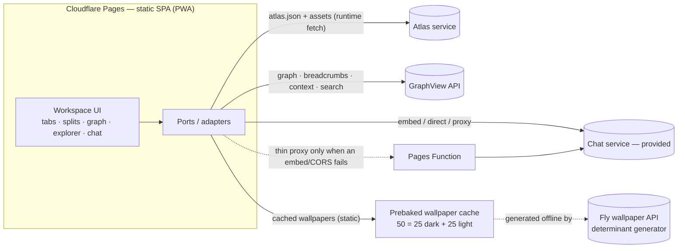

# Architecture

A personal site that behaves like a small knowledge workspace — "Obsidian in the
browser": a tiling / tab workspace over documents, with a navigable graph, a file
explorer, a chatbot, and a rotating ambient wallpaper. Design direction: **Ink
Islands** (a Netflix-style billboard hero + sharp content islands on an ambient
determinant wallpaper).

The whole thing is **static**. It renders content supplied by external services;
it does not own that content, and it has no backend of its own beyond optional
thin proxies.

---

## The one idea: Engine vs. Atlas

The system splits cleanly in two:

- **The Atlas** (and its siblings) are the *source of truth* for content — documents,
  thumbnails, titles, descriptions, links, the graph, search, and RAG context. These
  are external services.
- **The site** is a thin, stable **rendering engine**. It knows *how* to display and
  arrange things, and almost nothing about *what*.

Consequence: day-to-day updates are **data changes in the Atlas**, not code changes
or redeploys. The engine only changes when a genuinely new *capability* is added
(a new pane type, a new custom block). This is what keeps a personal site from
becoming a chore.

---

## Topology



External services (all consumed through ports): **Atlas**, **GraphView**, **Chat**
(backend *and* client provided elsewhere), and the **Wallpaper** generator on Fly
(used to prebake a cache, never called live).

---

## Tech stack

| Layer | Choice | Notes |
|---|---|---|
| Language | TypeScript (strict) | Types are the docs and the contract |
| App | Vite + React 18 (static SPA) | Not Astro — this is an app shell, not a content site |
| UI | shadcn/ui + Base UI + Tailwind | Owned components, accessible primitives, token themes |
| Workspace | **dockview** | Obsidian tabs + tmux splits, serializable layout — the one flagship feature |
| Graph | react-force-graph-2d (canvas) | Obsidian-style click-through nav; lazy-loaded |
| Markdown | react-markdown + rehype-sanitize | Safe rendering of *external* content; **no MDX** |
| PDF | react-pdf (pdf.js) | Lazy-loaded per pane |
| Data | static `atlas.json` fetched at runtime | Content updates need no redeploy |
| State | Zustand (session) | Tiny; TanStack Query optional for fetch caching |
| Cross-platform | PWA (vite-plugin-pwa) | Installable everywhere; offline shell |
| Host | Cloudflare Pages + Pages Functions | Git-connected auto-deploy + optional thin seams |
| Tooling | Biome + Vitest + Playwright | Lint/format + unit + smoke E2E |

Architecture strength is deliberately **medium**: clean boundaries, ports, feature
folders, strict types — but no heavy registry frameworks or formal ADR ceremony
until something actually grows.

---

## Ports & adapters (the flexibility layer)

Every external capability is reached through a small typed **port** (an interface
with one job). Each port can be *fulfilled* four ways without the UI caring — so
"I can't iframe X" is a config swap, not a redesign:

1. **Client embed** — iframe / web component / provider SDK (cheapest; zero server).
2. **Direct browser → API** — a thin first-party UI against an open API.
3. **Proxied** — a ~15-line **Pages Function** forwards the call (CORS/token/embedding blocked).
4. **Delegated** — point the port at a Fly service (only if a real backend ever appears).

The chat port is the motivating case: its backend and client are provided
elsewhere, and whether it embeds cleanly is unknown — so it ships behind
`ChatPort` and can fall back through the four modes above.

---

## Frontend architecture

- **Engine / Atlas split** — the app fetches `atlas.json` at runtime through an
  `AtlasClient` adapter (an anti-corruption layer; if the Atlas changes shape, only
  the adapter changes).
- **Panes & Views** — the workspace hosts panes; each pane renders a *View*
  (`MarkdownView`, `PdfView`, `GraphView`, `ExplorerView`, `ChatView`,
  `CollectionView`, `CustomView`). Views map from a `type` → component.
- **Workspace** — dockview provides splits (tmux) and tabs (Obsidian); layout is
  serialized to IndexedDB so sessions restore and can be shared.
- **Navigation** — three interchangeable ways in: the **graph** (click-through),
  the **file explorer** (tree over `Document.path`), and header **breadcrumbs**.
  The graph, breadcrumbs, context and search all come from the **GraphView API**.
- **Pages & Sections** — a declarative typed config: which documents feed a page,
  its layout, and any custom blocks. Curation lives here, not in imperative wiring.
- **Blocks** — custom, coded components that are *not* markdown (the banner, bespoke
  style elements). Placed by a page config, or embedded from markdown via a safe
  directive (never MDX / arbitrary code).
- **Chat** — a `ChatView` behind `ChatPort`; the heavy RAG/context is the GraphView
  service's job, not the site's.
- **Wallpaper** — a cache-first `WallpaperPort` (below).

---

## External-service contracts

The authoritative shapes live in **[`mock-api/src/types.ts`](mock-api/src/types.ts)**,
and the **[mock API](mock-api/README.md)** is a runnable reference implementation
of every contract. Summary:

- **Atlas** — `Document` (markdown | pdf) with `title`, `thumbnailUrl`,
  `description?`, `tags`, `links` (→ graph edges), `path` (→ explorer),
  `collectionIds` (→ pages/sections), `contentUrl`, and `associated[]` (arbitrary
  extra files of any `kind`/`mime` — e.g. a video on a markdown). `Collection` =
  a curated page/section.
- **Wallpaper** — a 50-entry cache (`25 dark + 25 light`); each entry carries a
  `palette`, an image `url`, and a `specUrl` (render-spec).
- **GraphView** — `GET /graph`, `/graph/neighbors/:id`, `/graph/breadcrumbs/:id`,
  `/graph/context?q=` (RAG for chat).
- **Chat** — `POST` → OpenAI-style SSE (`delta` chunks → `[DONE]`), grounded on
  GraphView context.
- **Search** — `?mode=basic|rich`. See below.

### Search strategy (a toggle, not one path)

1. **Default: client-side** search in the browser over the loaded markdowns.
2. **Toggle: backend basic** (`/search?mode=basic`) — used only when there are so
   many documents that in-browser search gets slow.
3. **Secondary: GraphView rich** (`/search?mode=rich`) — graph-aware, returns
   related nodes; opt-in, usable alongside the others.

### Wallpaper strategy (cache-first)

The determinant wallpaper generator stays live on Fly, but is **never called 50×
at runtime**. Instead the cache of 50 images (25 dark + 25 light, keyed to the
theme palettes) is **prebaked by running the generator locally/offline**, served
statically, and **rotated** on load. A `specUrl` render-spec lets the client paint
a wallpaper crisply on a canvas instead of pulling a PNG. This gives fast first
paint with no cold-start dependency.

---

## Cross-platform & performance

- **One responsive PWA** = every platform immediately (installable on desktop/mobile
  from the browser, offline shell, no native builds). Capacitor/Tauri could wrap the
  same code later if ever needed — not now.
- The initial bundle is React + shadcn + dockview + shell; **PDF, graph, and the
  chat client are code-split** and load only when their pane opens.

---

## Hosting, deploy, CI/CD

- **Cloudflare Pages** serves the static SPA; **Pages Functions** provide the optional
  thin proxies (same repo, same deploy — keeps the "just push and it deploys" flow).
- The custom domain's DNS/nameservers move to **Cloudflare**; the existing **Vercel
  maintenance splash stays live during the build and the domain cuts over at launch**,
  after which Vercel is retired.
- CI/CD = GitHub → Pages auto-deploy with preview URLs. No separate backend pipeline.

---

## Repository layout

```
far-flare/
  mock-api/            # local-dev mock of the external services (committed)
  archaic/             # the previous site, archived for reference
  src/, astro.config…  # the Vercel maintenance splash (live until cutover)
  ARCHITECTURE.md      # this file
  DECISIONS.md         # the decision log
  <app/>               # the Vite + React SPA (to be scaffolded)
    core/atlas/        #   AtlasClient port + adapter, types
    core/ports/        #   chat / wallpaper / graph ports
    workspace/         #   dockview integration + session persistence
    views/             #   pane types
    blocks/            #   custom components (banner, …)
    pages/             #   declarative page/section configs
    ui/                #   shadcn / Base UI components
    theme/             #   Ink tokens
```

---

## Local development

```bash
# terminal 1 — the mock services
cd mock-api && npm install && npm run dev     # http://localhost:8787

# terminal 2 — the app (once scaffolded)
#   point the ports' base URL at http://localhost:8787
```

---

## Extending the site (the "drop someone in" golden paths)

- **New content** → edit the Atlas. Nothing in the app changes.
- **New pane / document type** → add a `View`, map its `type` → component.
- **New custom visual (like the banner)** → add a `Block`; use it from a page config
  or a markdown directive.
- **New page/section** → add a typed config object.
- **New integration, or an embed that broke** → add/adjust a port fulfillment
  (embed → direct → Pages-Function proxy).
