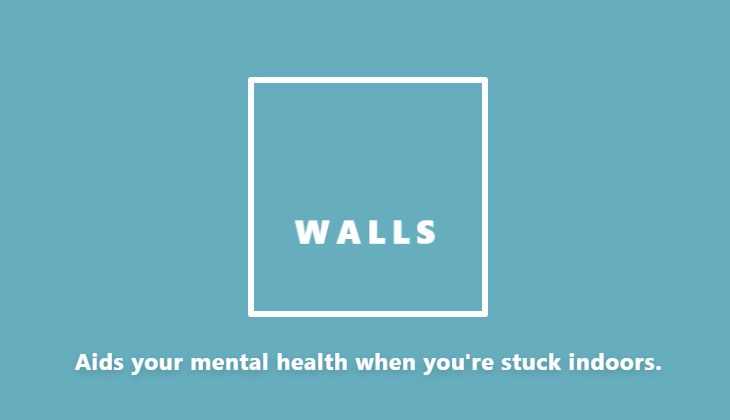
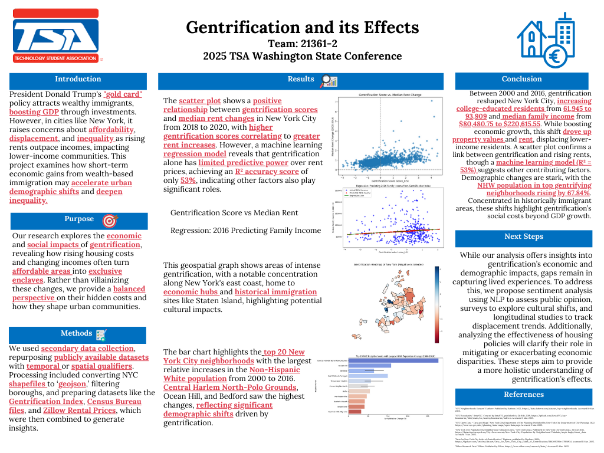

# 🌈 Personal Portfolio - Saksham Singh

<div align="center">


**A dynamic, mathematics-driven portfolio website showcasing projects at the intersection of computer science, data, and design**

[](https://astro.build)
[](https://vercel.com)
[](https://www.typescriptlang.org/)

[**View Live Site →**](https://your-domain.vercel.app)

</div>

---

## ✨ Features

### 🎨 **Generative Background System**
Mathematical wallpaper generation using brute-force linear algebra - searching for matrices with maximized determinants to render abstract geometric patterns.

<div align="center">
  
</div>

### 🎭 **Smart Animation System**
- **First Visit**: Rainbow RGB gradient cycling, typewriter text effects, smooth hero transitions
- **Return Visits**: Cookie-based animation skipping - instant load with final state preserved
- **Accessibility**: Respects `prefers-reduced-motion` settings

### 📱 **Project Showcase**

<table>
<tr>
<td width="50%">

#### **Paper Pigeon**
3D force-directed graph mapping UW Allen School's research ecosystem with RAG pipelines


</td>
<td width="50%">

#### **WALLS**
Mental health assessment platform using PyTorch for stress, anxiety, and depression screening



</td>
</tr>
<tr>
<td width="50%">

#### **Quantitative Trading**
Pairs trading pipeline using Ornstein-Uhlenbeck processes with 25+ research visualizations


</td>
<td width="50%">

#### **Data Science Projects**
High school data science assignments using Pandas, GeoPandas, NumPy, and Scikit-learn



</td>
</tr>
</table>

---

## 🏗️ Architecture

### **Tech Stack**
- **Framework**: [Astro 5.16.5](https://astro.build) - Static site generation with island architecture
- **Styling**: Pure CSS with custom properties, no frameworks
- **Deployment**: Vercel with serverless API proxy
- **Background API**: Python/Flask on Fly.io for mathematical wallpaper generation

### **Project Structure**
```
far-flare/
├── src/
│   ├── components/        # Reusable UI components
│   │   └── visuals/       # Custom project card visuals
│   ├── content/
│   │   └── work/          # Markdown project detail pages
│   ├── data/
│   │   ├── projectRegistry.ts   # Central project metadata
│   │   └── blogRegistry.ts      # Blog entry registry
│   ├── layouts/           # Page layout templates
│   ├── pages/             # Route-based pages
│   ├── scripts/           # Client-side TypeScript modules
│   │   ├── accentIntro.ts       # RGB gradient animation
│   │   ├── textAppearance.ts    # Typewriter & fade-in system
│   │   ├── heroTransition.ts    # Hero section sliding
│   │   ├── backgroundState.ts   # Background generator state
│   │   └── accentTheme.ts       # Theme-aware accent colors
│   └── styles/
│       └── global.css     # Design tokens & theming
└── public/
    ├── favicon.svg        # Terminal icon
    └── assets/            # Static images & backgrounds
```

### **Key Systems**

#### **Dynamic Accent Color System**
```typescript
// Automatically updates accent colors based on background hue
// Maintains proper contrast in both light/dark modes
accentTheme.ts → CSS custom properties → Global theme update
```

#### **Content-First Architecture**
```typescript
// Projects defined in registry, not hardcoded
export const projectRegistry: ProjectCard[] = [
  {
    id: 'paper-pigeon',
    title: 'Paper Pigeon',
    visualComponent: 'PaperPigeonVisual',
    colorTheme: 'white',
    publishDate: new Date('2025-11-15')
  }
]
```

#### **One-Time Animation Cookie System**
```typescript
// First visit: Full animations
if (!hasSeenAnimation()) {
  runTypewriterEffect();
  runRGBCycling();
  markAnimationSeen();
}
// Return visit: Instant final state
```

---

## 🚀 Getting Started

### **Prerequisites**
- Node.js 18+
- npm or pnpm

### **Local Development**
```bash
# Clone repository
git clone https://github.com/sks17/far-flare.git
cd far-flare

# Install dependencies
npm install

# Start dev server
npm run dev
# → http://localhost:4321

# Build for production
npm run build

# Preview production build
npm run preview
```

### **Environment Variables**
```bash
# .env.local (optional)
PUBLIC_API_URL=https://mathematical-wallpaper-api.fly.dev/api
```

---

## 🎯 Project Highlights

### **Background Generation System**
- Brute-force linear algebra matrix search
- Real-time canvas rendering with WebGL optimization
- Distributed rendering architecture (Python/Flask API)
- Client-side caching with localStorage
- Customizable hue, saturation, brightness, determinant

### **Experience Cards**
Custom three-column layouts with company logos:
- **SEAL Lab** (University Research): Web engineering & data systems
- **LiberatedLogic** (Startup): React-based product development

### **Blog System**
- Editorial NYT-style layout
- Custom category displays ("MATH / EXPLORATION", "AI SAFETY")
- "Coming soon" state with click prevention
- Featured image support with lazy loading

---

## 📊 Performance

- **Lighthouse Score**: 95+ on all metrics
- **Build Time**: ~30s static generation
- **Bundle Size**: < 100KB initial JS
- **Cache Strategy**: 1 year for assets, must-revalidate for HTML

---

## 🎨 Design Philosophy

### **Minimalist, Content-First**
- No UI frameworks or external dependencies (only Astro)
- Pure CSS with custom properties for theming
- Typography-driven hierarchy
- Generous whitespace and breathing room

### **Theme-Aware Everything**
- Light/dark mode with system preference detection
- Dynamic accent colors synchronized with background
- Smooth theme transitions
- Persistent user preferences

### **Accessibility Priority**
- ARIA labels on interactive elements
- Keyboard navigation support
- `prefers-reduced-motion` respected
- Semantic HTML structure

---

## 📁 Adding New Projects

1. **Create Visual Component** (optional):
   ```astro
   <!-- src/components/visuals/MyProjectVisual.astro -->
   <div class="custom-visual">
     <!-- Your custom layout -->
   </div>
   ```

2. **Add to Registry**:
   ```typescript
   // src/data/projectRegistry.ts
   {
     id: 'my-project',
     title: 'My Project',
     visualComponent: 'MyProjectVisual',
     colorTheme: 'cyan',
     publishDate: new Date('2025-01-15')
   }
   ```

3. **Create Markdown Page**:
   ```markdown
   ---
   # src/content/work/my-project.md
   title: My Project
   publishDate: 2025-01-15
   img: /assets/my-project.png
   tags: [Tag1, Tag2]
   ---
   Project description...
   ```

See [docs/adding-new-projects.md](docs/adding-new-projects.md) for complete guide.

---

## 🔧 Configuration

### **Vercel Settings**
- **Framework**: Astro
- **Build Command**: `npm run build`
- **Output Directory**: `dist/`
- **API Proxy**: Routes `/api/*` to Fly.io backend

### **Cache Headers**
```json
{
  "source": "/assets/(.*)",
  "headers": [{
    "key": "Cache-Control",
    "value": "public, max-age=31536000, immutable"
  }]
}
```

---

## 📝 License

This project is open source and available under the MIT License.

---

## 🙏 Acknowledgments

- **Design Inspiration**: Modern portfolio sites, NYT editorial layouts
- **Mathematical Background**: Linear algebra wallpaper generation research
- **Technology**: Astro team for incredible DX
- **Icons**: Custom terminal window icon

---

<div align="center">

**Built with ❤️ and ∇ by Saksham Singh**

🔗 [Website](https://your-domain.vercel.app) · 💼 [LinkedIn](#) · 📧 [Email](#) · 🐙 [GitHub](https://github.com/sks17)

</div>
